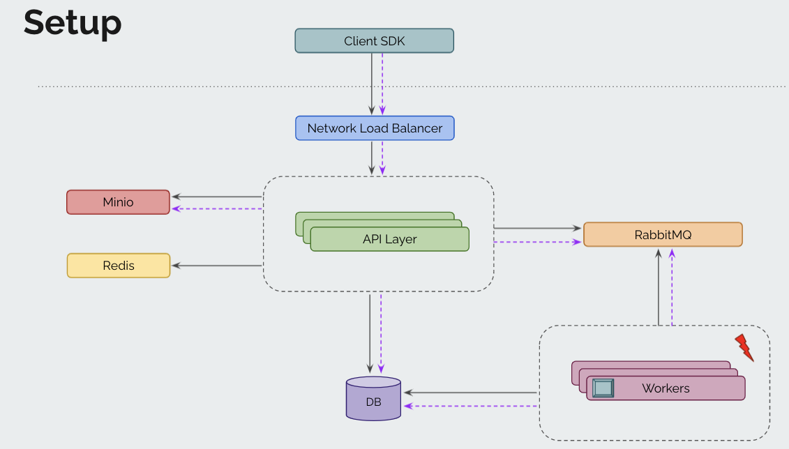

# Mock_eKYC

# Build HTTP APIs for an eKYC use case

eKYC consists of the following functionality.

1. Signup a new api client to get access and secret keys.

2. Upload Images and Metadata.

3. Perform face matching between two image ids to get the face match score.

4. Perform Optical Character Recognition (OCR) on images.

5. Generate client-wise reports for billing purposes.




> This is the overall system design, for this exercise, you will primarily focus on the API layer. To start with, you may not need all components, the most basic ones are API layer and Database and Minio (to store images). RabbitMQ, Workers and Redis can be added in V2 implementation.


## Assumptions

1. We will not build the ML models for face match and OCR. Instead, for face match, return a random number between 0 and 100 as a score. For OCR, return a structured JSON via any [faker library](https://github.com/bxcodec/faker).

2. You will need to setup
    - Postgresql
    - Redis Cache
    - RabbitMQ Queue

3. To get familiarity with relational databases, try creating a sample db with some tables, Get familiarity with basics of SQL like
    - select
    - insert
    - update
    - delete
    - and where clauses.

> Complete the basics section [here](https://pgexercises.com/questions/basic/).

4. Get to know basic redis commands like
    - set
    - get
    - del
    - incr etc.

5. Understand basic terminology of RabbitMQ and how you can create queues, producers and consumers. Refer this [basic tutorial](https://www.rabbitmq.com/tutorials/tutorial-one-go.html) and then this [producer-consumer pattern tutorial](https://www.rabbitmq.com/tutorials/tutorial-two-go.html).


## Expections

1. Set up golang repo for http APIs. Learn and use any popular Golang WEB framework. (Example: [Gin](https://github.com/gin-gonic/gin) or [Beego](https://github.com/beego/beego)).

2. Use a migration tool (Eg. [migrate](https://github.com/golang-migrate/migrate)) for creating and managing DB migrations.

3. Write test cases for controllers (HTTP layer) using httptest.NewRecorder(). For basic examples, refer [testing section of gin docs](https://github.com/gin-gonic/gin#testing).

4. You are expected to come up with DB modelling and detailed API design. This includes designing of db tables for storing information of clients, api_requests, api_responses for ocr and facematch, image metadata, etc.

5. Use HMAC signature based authentication method. (Chinmay to add more details).

6. Always try to get something working first before making it better. Commit and push your code as you complete tasks. The git commit history should demonstrate the progress of the solution.

### API Spec
1. Signup a new API client to get access and secret keys (ETA: 2-3 days)
    - A new API client can signup for one of the three plans - basic, advanced or enterprise. The details of the plan are as follows.

        - Basic plan:
            -Daily base cost: $10
            - Face match and OCR: $0.1 per API call
            - Image upload: $0.1 per 1Mb storage

        - Advanced plan:
            - Daily base cost: $15
            - Face match and OCR: $0.05 per API call
            - Image upload: $0.05 per 1Mb storage

        - Enterprise plan:
            - Daily base cost: $20
            - Face match and OCR: $0.1 per API call
            - Image upload: $0.01 per 1Mb storage

Make these values configurable for easy testing for the test use case. Use the pricing when generating daily and monthly invoice reports for clients.

1. POST http://localhost:8080/api/v1/signup

    a. Request body
    ```JSON
    {
        "name": "ABC corp",
        "email": "admin@abccorp.com"
        "plan": "basic" // must be one of "basic", "advanced" or "enterprise"
    }
    ```
    a. Response body: (200 ok)
    ```JSON
    {
        "accessKey": "10-char-string",
        "secretKey": "20-char-string"
    }
    ```
    - Response body: (400 bad request) when plan is invalid
    ```JSON
    {
        "errorMessage”: "invalid plan, supported plans are basic, advanced, or enterprise"
    }
    ```
    - Response body: (400 bad request) when email address is invalid
    ```JSON
    {
        "errorMessage”: "invalid email"
    }

## Some design points to think about:

- Perform a validation to ensure plan and email request params are valid. Write test cases for this validation.
- Design a table schema to store the input data (ex. clients table and plans table). Add a 1:1 relationship between clients and a plan table. Seed plan table data as part of seed data script.
- Think about how will you identify API calls (image upload vs face match vs OCR).
- Think about how you will represent the plan details (name, base cost, API pricing and storage pricing). Come up with a table structure and sample data.
- Where will you store access and secret keys? Clients table or some other table? How will you decide?
- Upload images with metadata (ETA 2-3 days)
- For ekyc, we can upload any image in png or jpeg format. The image will have metadata specifying what image it is (face or id_card). For simplicity, we will assume only one type of ID card and also assume all ID card info is available on front side of ID card.
- For invoicing purpose, we will also have to store size of the image (in kb or mb) in the database. The size of the image should be calculated on server side. Upload image as a file blob or as a base64 encoded string as part of json request body.

### POST http://localhost:8080/api/v1/image

- Request headers: Auth header containing accessKey and secretKey from signup API
- Request body (file to be uploaded via multipart form data along with json metadata)

    ```JSON
    {
        "type": "face", // must be one of "face" or "id_card"
        "file": <file-content-as-blob-via-multipart-form-upload>
    }
    ```

    - Response body: (200 ok)
    ```JSON
    {
        "id": "<uuid>"
    }
    ```

    - Response body: (400 bad request) when type is invalid
    ```JSON
    {
        "errorMessage”: "invalid type, supported types are face or id_card"
    }
    ```

    - Response body: (401 unauthorized) when accessKey or secretKey combination is invalid
    ```JSON
    {
        "errorMessage”: "invalid access or secret key"
    }

## As part of the implementation of this API, you will need think about following:

- Validate accessKey and secretKey, from this, find out the client making the request.
- Validate file type (must be face or id_card)
- Store file metadata in some table (ex. files table). Associate file with client via foreign key relationship
- Calculate and store file metadata like type, extension (jpeg, png), file_size_kb, file_storage_path, etc.
- Integrate with Minio for storing the file. Come up with bucket name, directory structure for storing files for various clients.
- Perform face matching between two image ids to get the face match score (ETA 1-2 days)
- Face matching can be between two face images or between a face and an id card image. As an output, return a random number between 0 to 100 indicating the percentage match.


### POST http://localhost:8080/api/v1/face-match

- Request headers: Auth header containing accessKey and secretKey from signup API
- Request body
    ```JSON
    {
        "image1": "uuid-of-first-image",
        "image2": "uuid-of-second-image"
    }
    ```
    - Response body: (200 ok)
    ```JSON
    {
        "score": 82
    }
    ```
    - Response body: (400 bad request) when one or more image ids don’t exist or belong to the client
    ```JSON
    {
        "errorMessage": "invalid or missing image id"
    }
    ```

## Implementation notes:

- Validate access and secret key combination to get the client id
- Validate both image ids belong to the same client from step 1 above. Basically, we can’t match faces across images from multiple clients.
- Store the score in db table (figure out which one) for reporting purpose later.
- Perform optical character recognition (OCR) on images (ETA 1-2 days)
- OCR is done on an id_card image, not on a face image. As part of OCR, return a structured JSON response.


### POST http://localhost:8080/api/v1/ocr

- Request headers: Auth header containing accessKey and secretKey from signup API
- Request body
    ```JSON
    {
        "image1": "uuid-of-image"
    }
    ```
    - Response body: (200 ok) Generate all these fields via faker library.
    ```JSON
    {
        "name": "John Adams",
        "gender": "Male",
        "dateOfBirth": "1990-01-24",
        "idNumber": "1234-1234-1234",
        "addressLine1": "A2, 201, Amar Villa",
        "addressLine2": "MG Road, Pune",
        "pincode": "411004"
    }
    ```
    - Response body: (400 bad request) when image id don’t exist or belong to the client
    ```JSON
    {
        "errorMessage": "invalid or missing image id"
    }
    ```
    - Response body: (400 bad request) when image id is of a face instead of an id card

    ```JSON
    {
        "errorMessage": "not an id card image"
    }
    ```

1. Reporting - generate client wise daily/weekly/monthly reports for billing purposes via cron jobs (ETA 2-3 days)
2. Via a cron job, generate client-wise billing reports. Track api requests and responses for all requests from all clients.
3. Generate a single daily report in following format for all clients.
4. Client_id, name, plan, date, total_facematch_for_that_day,  total_ocr_for_that_day total_image_storage_in_mb, api_useage_cost_usd, storage_cost_usd
5. Generate a monthly report for a specific client indicating day-wise API call details and total monthly invoice amount.